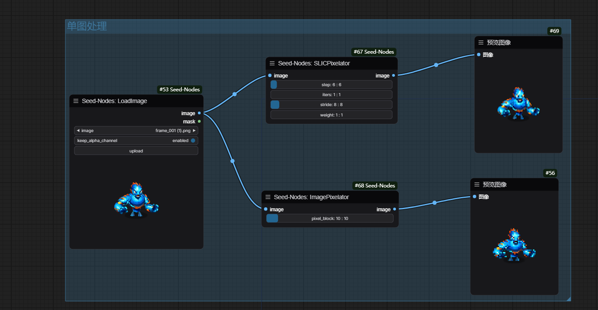
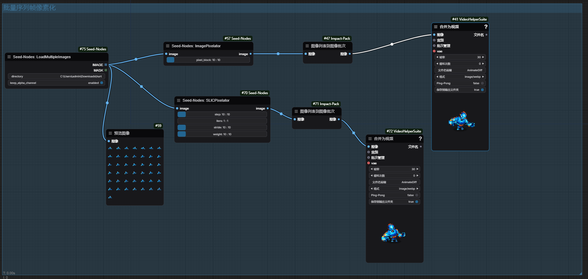

# ComfyUI-Seed-Nodes


## 介绍

**ComfyUI-Seed-Nodes** 是一个为 [ComfyUI](https://github.com/comfyanonymous/ComfyUI) 提供自定义节点的集合。这些节点扩展了 ComfyUI 的功能，提供了高级图像处理能力，如图像像素化和多图像加载。

## 演示



## 功能

- **LoadImage**: 加载单张图像，支持可选的 alpha 通道保留。
- **LoadMultipleImages**: 从指定目录加载多张图像。
- **ImagePixelator**: 根据指定的像素块大小对图像应用像素化效果。
- **SLICPixelator**: 使用 SLIC（Simple Linear Iterative Clustering）算法进行高级图像像素化处理。

## 安装

### 前置条件

- [Python 3.7+](https://www.python.org/downloads/)
- [ComfyUI](https://github.com/comfyanonymous/ComfyUI)

### 步骤

1. **克隆仓库**

   ```bash
   git clone https://github.com/Seed/ComfyUI-Seed-Nodes.git
   ```

2. **导航到项目目录**

   ```bash
   cd ComfyUI-Seed-Nodes
   ```

3. **安装自定义节点**

   将 `ComfyUI-Seed-Nodes` 文件夹复制到 ComfyUI 的 `custom_nodes` 目录中。

   ```bash
   cp -r ComfyUI-Seed-Nodes <path_to_ComfyUI>/custom_nodes/
   ```

   将 `<path_to_ComfyUI>` 替换为您 ComfyUI 安装的实际路径。

4. **重启 ComfyUI**

   重启 ComfyUI 以加载新的自定义节点。

## 使用

### LoadImage 节点

**LoadImage** 节点允许您将单张图像加载到 ComfyUI 中，并可选择是否保留 alpha 通道。

**输入:**
- `image`: 选择要加载的图像文件。
- `keep_alpha_channel`: 是否保留图像的 alpha 通道。

**输出:**
- `image`: 加载的图像张量。
- `mask`: 对应的遮罩张量。

### LoadMultipleImages 节点

**LoadMultipleImages** 节点允许您从指定目录批量加载图像。

**输入:**
- `directory`: 指定图像所在的目录路径。
- `keep_alpha_channel`: 是否保留图像的 alpha 通道。

**输出:**
- `IMAGE`: 图像张量列表。
- `MASK`: 遮罩张量列表。

### ImagePixelator 节点

**ImagePixelator** 节点根据指定的像素块大小对图像应用像素化效果。

**输入:**
- `image`: 输入图像张量。
- `pixel_block`: 像素块大小。

**输出:**
- `image`: 像素化后的图像张量。

### SLICPixelator 节点

**SLICPixelator** 节点使用 SLIC 算法进行高级图像像素化处理。

**输入:**
- `image`: 输入图像张量，形状应为 (C, H, W) 或 (1, C, H, W)。
- `step`: SLIC 网格步长。
- `iters`: SLIC 迭代次数。
- `stride`: SLIC 像素化步幅。
- `weight`: SLIC 颜色距离权重。

**输出:**
- `image`: 像素化后的图像张量。

## 示例

以下是如何在 ComfyUI 中使用这些自定义节点的简单示例：

1. 添加 **LoadImage** 节点并选择要加载的图像。
2. 将 **LoadImage** 节点的输出连接到 **ImagePixelator** 节点。
3. 调整 **ImagePixelator** 节点的 `pixel_block` 参数以设置像素化程度。
4. 将 **ImagePixelator** 节点的输出连接到显示节点（如 **Image Viewer**）。

## 许可证

本项目采用 [MIT 许可证](LICENSE) 进行许可。

### 第三方依赖

- **ComfyUI-Light-Tool**: 遵循 [MIT 许可证](LICENSE)。

其他依赖项同样遵循各自的许可证。

## 贡献

欢迎贡献！请遵循以下步骤：

1. Fork 本仓库。
2. 创建您的特性分支 (`git checkout -b feature/YourFeature`)。
3. 提交您的更改 (`git commit -m 'Add some feature'`)。
4. 推送到分支 (`git push origin feature/YourFeature`)。
5. 打开一个 Pull Request。

## 联系方式

如果您有任何问题或建议，请通过 [GitHub Issues](https://github.com/Seed/ComfyUI-Seed-Nodes/issues) 与我们联系。

## 参考

- [ComfyUI](https://github.com/comfyanonymous/ComfyUI)
- [MIT 许可证](https://opensource.org/licenses/MIT)
